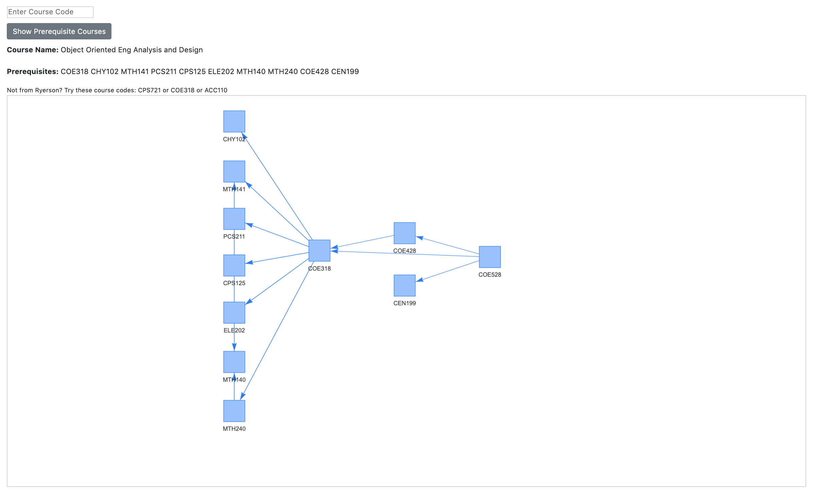

### Demo: [CourseMap](https://coursemap.netlify.app/)

# Course Map
It's time to declare what courses you want to take. You head over to your school's website to click around to the course catalog and see you want to take. *GEO 881: The Hidden Geometry of Waterpolo*. Wow. Dream course. Looks like there's some prerequisite courses but they're all linked in the course description. You check them out.

*open in new tab* *open in new tab* *open in new tab* 

You look at the first one: *GEO 532: The Geometry of Water and Polo*. You think "That kind of makes sense. I should probably learn the basics first." ...But that has a bunch of pre-reqs too.

*open in new tab* *open in new tab* *open in new tab* *open in new tab* *open in new tab* *open in new tab* *open in new tab* 

and before you know it you have 23 tabs open, completely lost your context, and abandoned university altogether.

(ok maybe that story was a bit too dramatic...)

...But it's actually kind of a problem that you can't "map" out your courses and see exactly what you need to take. Let's fix that. Course Map is a super light-weight web app that helps you present the course data as a graph instead. When you search up a course, a graph (or tree) appears showing the exact prerequisites you need all the way back to base courses in freshman year. 

Course Map is fast because front-end JS libraries and is written completely in vanilla javascript. There's no backend either. The UI is styled in [Bootstrap](https://getbootstrap.com/) and included through the hosted bootstrap CDN.

# Make Your Own 
To adapt to coursemap to your school's curriculum, all you need is to replace the contents in the `curriculum.js` file with an object that adheres to this schema:  

```javascript
var curriculum = {
    // First element of the course array is always the full name of the course to be displayed
    "COURSECODE1": ["FULLNAMEOFCOURSE1", "PREREQ1","PREREQ2"]
    "COURSECODE2": ["FULLNAMEOFCOURSE2", "PREREQ1",...,"PREREQN"] 
    ... 
    // Courses can have many prerequisites
}
```
Next, in the `index.html` file, change the `onload='calculate("COE528")'` attribute in the `body` tag to the course code of the course the app should display after loading. 

## Getting the Data
Some schools may provide an API for you to be able to get registrar information through a REST endpoint but unfortunately (or maybe fortunately? if so i might not be writing this?) I didn't go to one of those schools. This may involve some web crawling/parsing to figure out. 

A great method for web parsing if you're familiar with Python is [BeautifulSoup](https://www.crummy.com/software/BeautifulSoup/bs4/doc/) + [Requests](https://requests.readthedocs.io/en/master/). Requests is one of the quickest libraries to make HTTP requests to webpages with and BeautifulSoup allows you to create HTML "soup" objects where you can browse around the tree. Let's go through a quick example with both of these libraries.

Suppose we're presented with a directory page that links to each individual course where the page title is the name of a course and we'd like to save all the names of the courses. That might look something like this:
```python
courseNames = []
# Make a request to the webpage we'd like to get
html = requests.get('https://course.website')
# Create a soup object from the response of the HTTP request
soup = BeautifulSoup(html.text,'html.parser')
# In our page let's find all the <a> links and iterate through them!
for link in soup.find_all('a'):
    # For every link, let's get the hyperlink and make an HTTP request to it
    response = requests.get(link.get('href')))
    # Save the page content
    page = response.text
    # Create a "soup" for the current page
    sp = BeautifulSoup(page,'html.parser')
    # Record the course name into our array
    courseNames.append(sp.title.string)
print(courseNames)
```

For more examples, check out the documentation for [BeautifulSoup](https://www.crummy.com/software/BeautifulSoup/bs4/doc/) and [Requests](https://requests.readthedocs.io/en/master/).


